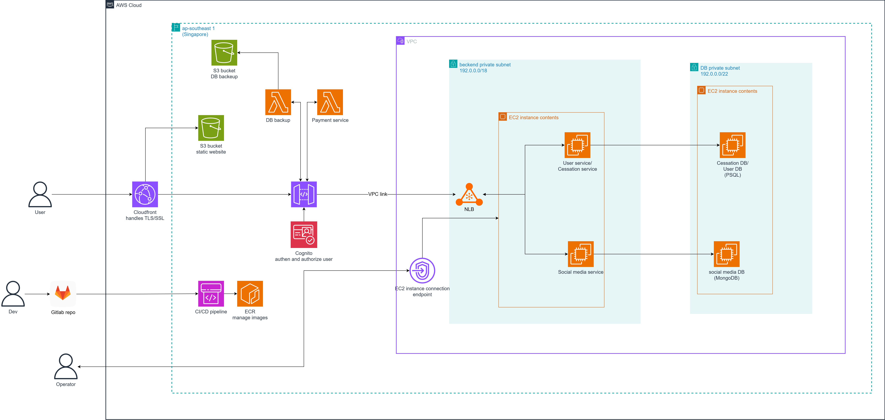

## Overview

This module covers detailed prerequisites and IAM permission policies needed to deploy and manage resources in this workshop.

---

## IAM Permissions

Attach the following IAM permission policy to your AWS user account to deploy and cleanup resources in this workshop:

```json
{
    "Version": "2012-10-17",
    "Statement": [
        {
            "Sid": "VisualEditor0",
            "Effect": "Allow",
            "Action": [
                "cloudformation:*",
                "cloudwatch:*",
                "ec2:AcceptTransitGatewayPeeringAttachment",
                "ec2:AcceptTransitGatewayVpcAttachment",
                "ec2:AllocateAddress",
                "ec2:AssociateAddress",
                "ec2:AssociateIamInstanceProfile",
                "ec2:AssociateRouteTable",
                "ec2:AssociateSubnetCidrBlock",
                "ec2:AssociateTransitGatewayRouteTable",
                "ec2:AssociateVpcCidrBlock",
                "ec2:AttachInternetGateway",
                "ec2:AttachNetworkInterface",
                "ec2:AttachVolume",
                "ec2:AttachVpnGateway",
                "ec2:AuthorizeSecurityGroupEgress",
                "ec2:AuthorizeSecurityGroupIngress",
                "ec2:CreateClientVpnEndpoint",
                "ec2:CreateClientVpnRoute",
                "ec2:CreateCustomerGateway",
                "ec2:CreateDhcpOptions",
                "ec2:CreateFlowLogs",
                "ec2:CreateInternetGateway",
                "ec2:CreateLaunchTemplate",
                "ec2:CreateNetworkAcl",
                "ec2:CreateNetworkInterface",
                "ec2:CreateNetworkInterfacePermission",
                "ec2:CreateRoute",
                "ec2:CreateRouteTable",
                "ec2:CreateSecurityGroup",
                "ec2:CreateSubnet",
                "ec2:CreateSubnetCidrReservation",
                "ec2:CreateTags",
                "ec2:CreateTransitGateway",
                "ec2:CreateTransitGatewayPeeringAttachment",
                "ec2:CreateTransitGatewayPrefixListReference",
                "ec2:CreateTransitGatewayRoute",
                "ec2:CreateTransitGatewayRouteTable",
                "ec2:CreateTransitGatewayVpcAttachment",
                "ec2:CreateVpc",
                "ec2:CreateVpcEndpoint",
                "ec2:CreateVpcEndpointConnectionNotification",
                "ec2:CreateVpcEndpointServiceConfiguration",
                "ec2:CreateVpnConnection",
                "ec2:CreateVpnConnectionRoute",
                "ec2:CreateVpnGateway",
                "ec2:DeleteCustomerGateway",
                "ec2:DeleteFlowLogs",
                "ec2:DeleteInternetGateway",
                "ec2:DeleteNetworkInterface",
                "ec2:DeleteNetworkInterfacePermission",
                "ec2:DeleteRoute",
                "ec2:DeleteRouteTable",
                "ec2:DeleteSecurityGroup",
                "ec2:DeleteSubnet",
                "ec2:DeleteSubnetCidrReservation",
                "ec2:DeleteTags",
                "ec2:DeleteTransitGateway",
                "ec2:DeleteTransitGatewayPeeringAttachment",
                "ec2:DeleteTransitGatewayPrefixListReference",
                "ec2:DeleteTransitGatewayRoute",
                "ec2:DeleteTransitGatewayRouteTable",
                "ec2:DeleteTransitGatewayVpcAttachment",
                "ec2:DeleteVpc",
                "ec2:DeleteVpcEndpoints",
                "ec2:DeleteVpcEndpointServiceConfigurations",
                "ec2:DeleteVpnConnection",
                "ec2:DeleteVpnConnectionRoute",
                "ec2:Describe*",
                "ec2:DetachInternetGateway",
                "ec2:DisassociateAddress",
                "ec2:DisassociateRouteTable",
                "ec2:GetLaunchTemplateData",
                "ec2:GetTransitGatewayAttachmentPropagations",
                "ec2:ModifyInstanceAttribute",
                "ec2:ModifySecurityGroupRules",
                "ec2:ModifyTransitGatewayVpcAttachment",
                "ec2:ModifyVpcAttribute",
                "ec2:ModifyVpcEndpoint",
                "ec2:ReleaseAddress",
                "ec2:ReplaceRoute",
                "ec2:RevokeSecurityGroupEgress",
                "ec2:RevokeSecurityGroupIngress"
            ],
            "Resource": "*"
        }
    ]
}
```

## How to Attach Policy

1. Go to IAM Console
2. Click "Users"
3. Select your workshop user
4. Click "Permissions" tab
5. Click "Add permissions" → "Attach policies directly"
6. Copy and paste the policy above as inline policy
7. Click "Create policy"

## Resources Covered

This policy allows you to manage:
- CloudFormation stacks
- EC2 instances, VPCs, Subnets
- Security Groups & Network Interfaces
- Internet Gateways, NAT Gateways, VPN connections
- Route tables & Transit Gateways
- CloudWatch logs and monitoring
---
title: "Module 1: Introduction to Smoking Cessation Platform Infrastructure"
date: "2025-01-01"
weight: 1
chapter: false
pre: " <b> 5.1. </b> "
---

## Module Objectives

- Understand the complete AWS architecture of the system
- Learn the main components of the platform
- Understand data flow between services
- Prepare for subsequent modules

---

## System Architecture Overview (Hybrid - EC2 + Lambda)

### AWS Architecture Diagram

**Architecture Type**: Hybrid (EC2 + Serverless Lambda)
**Deployment Pattern**: EC2 for stateful services, Lambda for event-driven tasks



---

## Main Components

### 1. Frontend Layer (React + Vite)

Hosting: S3 + CloudFront

Features:
- Responsive UI for Web & Mobile
- Real-time Chat with WebSocket
- User Authentication (Cognito)
- Progress Tracking Dashboard
- Coach Management Interface

### 2. API Gateway Layer

REST API: /api/v1/* endpoints
WebSocket: /ws endpoints for real-time chat

Responsibilities:
- Request routing
- Authentication validation
- Rate limiting
- CORS handling

### 3. Backend Layer (Hybrid: EC2 + Lambda)

**EC2 Application Servers (Always-on)**:
- user-cessation service (Port 8000)
  - User profiles, progress tracking
  - Coaching session management
  - Statistics & analytics

- social-media service (Port 8000)
  - Social features
  - Notifications
  - Community management

**Lambda Functions (Event-driven)**:
- File Upload Lambda
  - Handle image/file uploads to S3

- Payment Processing Lambda
  - Process payments & subscriptions

- Specific Trigger Functions
  - Webhooks
  - Scheduled tasks

### 4. WebSocket & Real-time Layer

NLB (Network Load Balancer):
- Handles persistent WebSocket connections
- Port 443 (HTTPS)
- Distributes real-time chat traffic
- Integration with EC2 backend servers

### 5. Database Layer (EC2-hosted)

**PostgreSQL Server (DB-PG)**:
- User profiles & authentication
- Progress tracking data
- Coaching session records
- Relational data

**MongoDB Server (DB-Mongo)**:
- Chat message history
- Social media content
- Message metadata
- Flexible schema data

### 6. Security Layer

- AWS Cognito: User authentication & authorization
- IAM Roles: Service-to-service permissions
- VPC: Network isolation (private subnets for databases)
- Security Groups: Firewall rules for EC2 & databases
- SSL/TLS: Data encryption in transit & at rest
- NLB Security Group: Restricts access to WebSocket port

