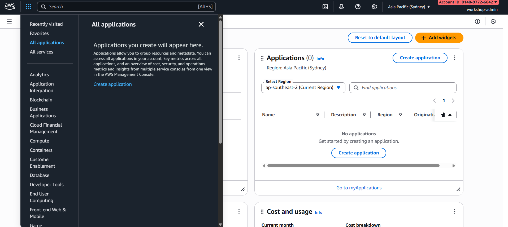

# Module 2: Prerequisites - Chuẩn Bị Tài Khoản & Tools

## Mục tiêu Module

- Tạo & cấu hình AWS account
- Thiết lập IAM roles & policies
- Chuẩn bị environment variables
- Verify quyền truy cập cần thiết

---

## Phần 1: AWS Account Setup

### Bước 1: Tạo AWS Account

Nếu chưa có AWS account:

1. Truy cập https://aws.amazon.com/
2. Click "Create an AWS Account"
3. Điền email, password, account name
4. Chọn Support Plan (Free tier available)
5. Verify email & setup billing information


### Bước 2: Login vào AWS Console

1. Truy cập https://console.aws.amazon.com/
2. Nhập root account email & password
3. Verify MFA (Multi-Factor Authentication) nếu được yêu cầu

**Note**: Nên bật MFA cho root account để bảo mật

---

## Phần 2: IAM Setup - Tạo Admin User

### Bước 1: Truy cập IAM Dashboard

1. Từ AWS Console, tìm kiếm "IAM"
2. Click "IAM" từ services list
3. Click "Users" trong navigation menu


### Bước 2: Tạo IAM User cho Workshop

1. Click "Create user"
2. Nhập User name: "workshop-admin"
3. Check "Provide user access to AWS Management Console"
4. Check "I want to create an IAM user"
5. Click "Next"


### Bước 3: Gán Permissions

1. Chọn "Attach policies directly"
2. Tìm và check các policies sau:
   - AdministratorAccess (cho phép toàn bộ services)
   - Hoặc gán theo từng service:
     - AmazonCognitoPowerUser
     - AWSLambdaFullAccess
     - AmazonRDSFullAccess
     - AmazonAPIGatewayAdministrator
     - AmazonS3FullAccess
     - IAMFullAccess
     - CloudWatchLogsFullAccess

3. Click "Next"


### Bước 4: Review & Create

1. Review thông tin user
2. Click "Create user"
3. Download ".csv" file chứa credentials (MẬT KHẨU TẠM)


### Bước 5: Login bằng IAM User

1. Copy User sign-in link từ confirmation screen
2. Mở link trong browser mới
3. Login bằng user name & temporary password
4. Đặt password mới


---

## Phần 3: Chuẩn Bị Environment Variables

### Bước 1: Lấy AWS Credentials

Từ IAM User:

1. Click vào user name "workshop-admin"
2. Chọn tab "Security credentials"
3. Click "Create access key"
4. Chọn "Command Line Interface (CLI)"
5. Check "I understand the above recommendation..."
6. Click "Next"
7. Click "Create access key"
8. Download ".csv" file hoặc copy keys


Keys bạn cần:
- Access Key ID
- Secret Access Key

### Bước 2: Tạo .env.aws file

Tại project root directory, tạo file `.env.aws`:

```
# AWS Configuration
AWS_ACCESS_KEY_ID=YOUR_ACCESS_KEY_ID_HERE
AWS_SECRET_ACCESS_KEY=YOUR_SECRET_ACCESS_KEY_HERE
AWS_REGION=us-east-1
AWS_ACCOUNT_ID=YOUR_AWS_ACCOUNT_ID_HERE

# Resource Names
PROJECT_NAME=smoking-cessation-platform
ENVIRONMENT=dev

# Cognito
COGNITO_USER_POOL_NAME=smoking-cessation-users
COGNITO_CLIENT_NAME=smoking-cessation-client

# Lambda
LAMBDA_EXECUTION_ROLE=smoking-cessation-lambda-role
LAMBDA_TIMEOUT=30
LAMBDA_MEMORY=256

# RDS
RDS_DB_NAME=smokingcessation
RDS_MASTER_USERNAME=admin
RDS_MASTER_PASSWORD=YourSecurePassword123!
RDS_DB_INSTANCE_IDENTIFIER=smoking-cessation-db

# API Gateway
API_GATEWAY_NAME=smoking-cessation-api
API_STAGE_NAME=dev

# S3
S3_BUCKET_NAME=smoking-cessation-frontend-dev
CLOUDFRONT_DISTRIBUTION_NAME=smoking-cessation-cdn-dev

# VPC
VPC_NAME=smoking-cessation-vpc
VPC_CIDR=10.0.0.0/16
```

**CẢNH BÁO**: Đừng commit .env.aws vào git! Thêm vào .gitignore

---

## Phần 4: Verify Permissions

### Kiểm tra quyền truy cập AWS Services

1. Login vào AWS Console bằng IAM user
2. Truy cập từng service để verify quyền:
   - Cognito: https://console.aws.amazon.com/cognito/
   - Lambda: https://console.aws.amazon.com/lambda/
   - RDS: https://console.aws.amazon.com/rds/
   - API Gateway: https://console.aws.amazon.com/apigateway/
   - S3: https://console.aws.amazon.com/s3/
   - VPC: https://console.aws.amazon.com/vpc/

**Kiểm tra**: Bạn nên thấy "Create" button hoặc services list (không phải error message)



---

## Phần 5: AWS CLI Setup (Optional)

Để sử dụng AWS CLI từ terminal:

### Bước 1: Cài AWS CLI

Windows (PowerShell):
```
msiexec.exe /i https://awscli.amazonaws.com/AWSCLIV2.msi
```

Linux/Mac:
```
curl "https://awscli.amazonaws.com/awscli-exe-linux-x86_64.zip" -o "awscliv2.zip"
unzip awscliv2.zip
sudo ./aws/install
```

### Bước 2: Configure AWS CLI

```
aws configure
```

Nhập:
- AWS Access Key ID: [from previous step]
- AWS Secret Access Key: [from previous step]
- Default region name: us-east-1
- Default output format: json

### Bước 3: Verify CLI

```
aws sts get-caller-identity
```

Output sẽ hiện account ID, user ARN, etc.

---

## Phần 6: Resources Naming Convention

Để quản lý resources dễ dàng, sử dụng naming convention:

```
{project-name}-{service}-{environment}
```

Examples:
- smoking-cessation-cognito-dev
- smoking-cessation-lambda-auth-dev
- smoking-cessation-rds-dev
- smoking-cessation-api-dev
- smoking-cessation-frontend-dev
- smoking-cessation-vpc-dev

**Benefit**: Dễ tìm kiếm & quản lý resources trong console

---

## Phần 7: Budget Alerts (Recommended)

### Setup Cost Monitoring

1. Truy cập Billing Console: https://console.aws.amazon.com/billing/
2. Click "Billing preferences"
3. Check "Receive PDF Invoice by Email"
4. Click "Create budget"
5. Setup budget alert cho $10/month (hoặc khác tùy nhu cầu)


---

## Checklist

- [ ] AWS Account tạo thành công
- [ ] IAM user "workshop-admin" được tạo
- [ ] Access Keys được tạo & lưu an toàn
- [ ] .env.aws file được tạo
- [ ] Quyền truy cập AWS services được verify
- [ ] AWS CLI cài đặt (optional)
- [ ] Budget alerts được setup
- [ ] MFA được bật cho root account

---

## Security Best Practices

1. Không share AWS credentials - lưu trong .env.aws
2. Định kỳ rotate Access Keys
3. Enable MFA cho tất cả users
4. Sử dụng strong passwords (min 16 characters)
5. Không sử dụng root account cho daily tasks
6. Audit IAM access thường xuyên
7. Monitor CloudTrail logs cho suspicious activities

---

## Troubleshooting

### Không thể create Access Keys

- Kiểm tra quyền: User cần có `iam:CreateAccessKey` permission

### AWS CLI command không hoạt động

- Verify: `aws sts get-caller-identity`
- Check credentials: `cat ~/.aws/credentials`
- Try: `aws configure` again

### Permission Denied errors

- Verify IAM policies attached
- Check resource ARNs
- May need to contact AWS support nếu cần elevated permissions

---

## Notes

- Từ bây giờ, tất cả actions đều sử dụng IAM user, không phải root
- Giữ .env.aws file an toàn & không public
- Mỗi service sẽ có specific IAM role (created ở modules tiếp theo)
- Free Tier cung cấp sufficient resources cho learning

---

## Kết Quả Đạt Được

Sau Module 2, bạn sẽ có:

1. AWS account đã activate
2. IAM user "workshop-admin" có quyền admin
3. Access Keys để sử dụng APIs
4. Environment variables configured
5. Sẵn sàng cho Module 3 (Setup Cognito)
