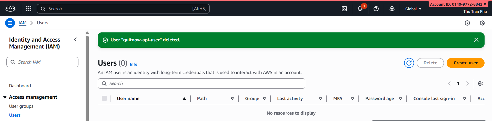
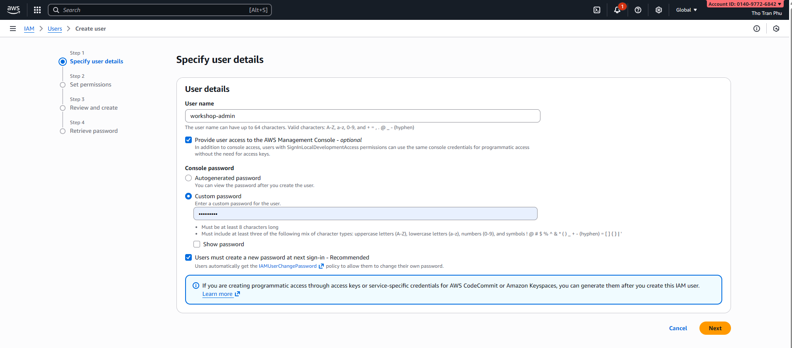
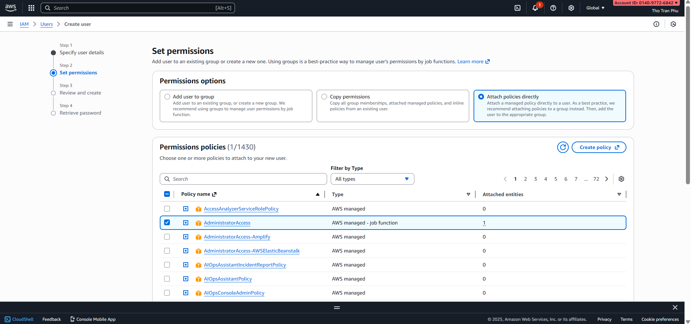
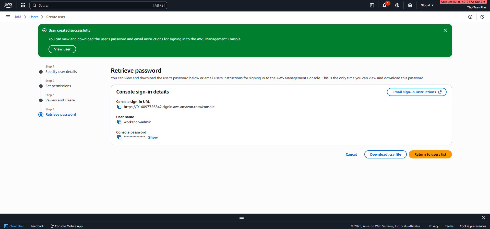
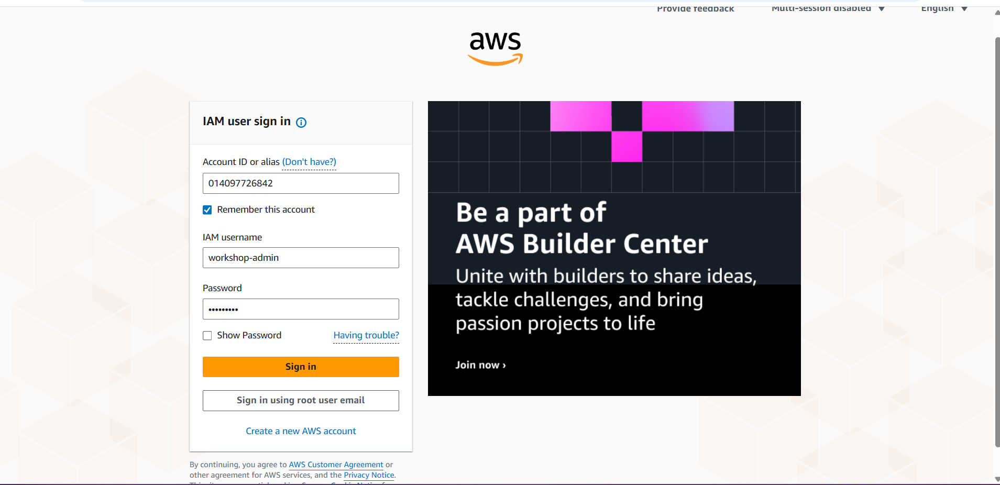

## Module Objectives

- Create & configure AWS account
- Setup IAM roles & policies
- Prepare environment variables
- Verify necessary access permissions

---

## Part 1: AWS Account Setup

### Step 1: Create AWS Account

If you don't have an AWS account:

1. Visit https://aws.amazon.com/
2. Click "Create an AWS Account"
3. Enter email, password, account name
4. Select Support Plan (Free tier available)
5. Verify email & setup billing information


### Step 2: Login to AWS Console

1. Visit https://console.aws.amazon.com/
2. Enter root account email & password
3. Verify MFA (Multi-Factor Authentication) if required

**Note**: Enable MFA for root account for security

---

## Part 2: IAM Setup - Create Admin User

### Step 1: Access IAM Dashboard

1. From AWS Console, search for "IAM"
2. Click "IAM" from services list
3. Click "Users" in navigation menu



### Step 2: Create IAM User for Workshop

1. Click "Create user"
2. Enter User name: "workshop-admin"
3. Check "Provide user access to AWS Management Console"
4. Check "I want to create an IAM user"
5. Click "Next"



### Step 3: Assign Permissions

1. Select "Attach policies directly"
2. Find and check the following policies:
   - AdministratorAccess (allows all services)
   - Or assign per service:
     - AmazonCognitoPowerUser
     - AWSLambdaFullAccess
     - AmazonRDSFullAccess
     - AmazonAPIGatewayAdministrator
     - AmazonS3FullAccess
     - IAMFullAccess
     - CloudWatchLogsFullAccess

3. Click "Next"



### Step 4: Review & Create

1. Review user information
2. Click "Create user"
3. Download ".csv" file containing credentials (TEMPORARY PASSWORD)



### Step 5: Login with IAM User

1. Copy User sign-in link from confirmation screen
2. Open link in new browser
3. Login with username & temporary password
4. Set new password



---

## Part 3: Prepare Environment Variables

### Step 1: Get AWS Credentials

From IAM User:

1. Click on user name "workshop-admin"
2. Select "Security credentials" tab
3. Click "Create access key"

For workshop use, select "Command Line Interface (CLI)" as use case.

### Step 2: Save Access Keys

Store the following securely:
- Access Key ID
- Secret Access Key

### Step 3: Configure AWS CLI (Optional but Recommended)

```bash
aws configure
# Enter Access Key ID
# Enter Secret Access Key
# Default region: ap-southeast-1
# Default output format: json
```

This allows you to use AWS CLI commands from terminal for workshop tasks.

