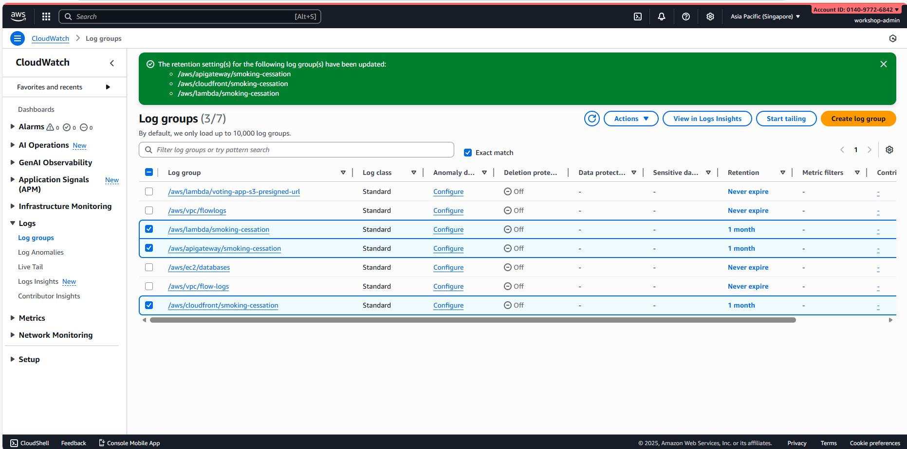
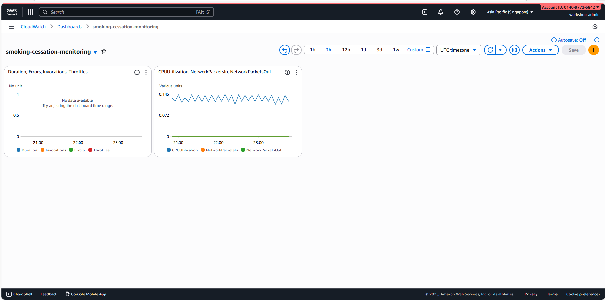
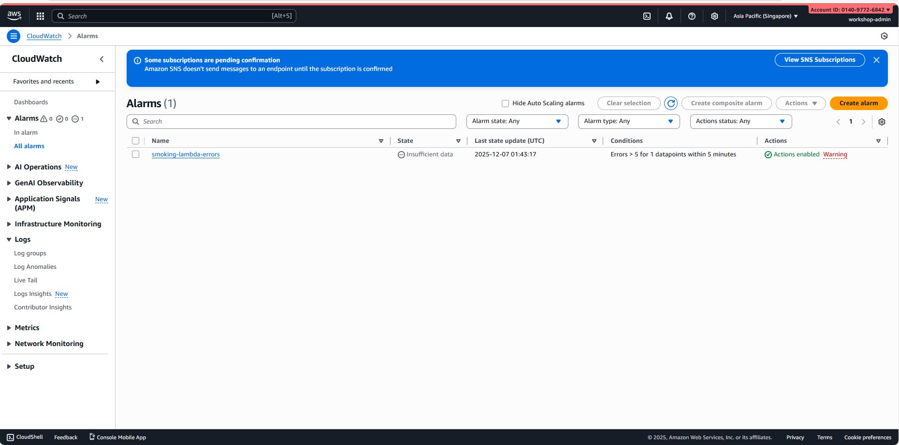

# Module 9: Setup CloudWatch Monitoring, Logging & Alerts

## Mục tiêu Module

- Tạo CloudWatch Log Groups cho tất cả services
- Tạo CloudWatch Dashboard để theo dõi metrics
- Tạo CloudWatch Alarms với SNS notifications
- Enable CloudTrail cho audit logging
- Enable X-Ray distributed tracing
- Setup Cost Monitoring & Budget Alerts
- Tạo CloudWatch Synthetics (health checks)
- Document incident response runbooks

**Duration**: 3-4 giờ

---

## Monitoring & Observability Architecture

Infrastructure monitoring sẽ cover:

```
CloudWatch Monitoring:
├── Logs (CloudWatch Logs)
│   ├── /aws/lambda/functions
│   ├── /aws/apigateway/apis
│   ├── /aws/ec2/databases
│   ├── /aws/vpc/flow-logs
│   └── /aws/s3/access-logs
├── Metrics & Dashboards
│   ├── EC2 (CPU, Network, Disk)
│   ├── Lambda (Invocations, Errors, Duration)
│   ├── API Gateway (Requests, Errors, Latency)
│   ├── CloudFront (Requests, Cache Hit Rate)
│   └── NLB (Connections, Target Health)
├── Alarms (SNS Notifications)
│   ├── High error rates
│   ├── High latency
│   ├── Resource exhaustion
│   └── Cost anomalies
└── Audit Trail
    ├── CloudTrail (API calls)
    └── X-Ray (Request tracing)
```

---

## Phần 1: Create CloudWatch Log Groups

### Bước 1: Create Lambda Log Groups

1. CloudWatch Console
2. Left menu: "Logs" → "Log groups"
3. Click "Create log group"
4. **Log group name**: `/aws/lambda/smoking-cessation`
5. Click "Create log group"

⏳ **Chờ log group được tạo**

**Note**: Lambda functions automatically create their own log streams, but creating parent log group allows custom configuration

### Bước 2: Create API Gateway Log Groups

1. Click "Create log group"
2. **Log group name**: `/aws/apigateway/smoking-cessation`
3. Click "Create log group"

### Bước 3: Create EC2 Databases Log Groups

1. Click "Create log group"
2. **Log group name**: `/aws/ec2/databases`
3. Click "Create log group"

### Bước 4: Create VPC Flow Logs Group

1. Click "Create log group"
2. **Log group name**: `/aws/vpc/flow-logs`
3. Click "Create log group"

### Bước 5: Create CloudFront Log Groups (Optional)

1. Click "Create log group"
2. **Log group name**: `/aws/cloudfront/smoking-cessation`
3. Click "Create log group"

**Result**: 5 log groups created for centralized logging

### Bước 6: Configure Log Retention Policies

For each log group:

1. Click on log group name
2. Actions → "Edit retention settings"
3. **Retention**: 30 days
   - Balances cost vs. historical data
4. Click "Save"

This prevents logs from consuming unlimited storage.



---

## Phần 2: Create CloudWatch Dashboard

### Bước 1: Create Dashboard

1. CloudWatch Console
2. Left menu: "Dashboards"
3. Click "Create dashboard"
4. **Dashboard name**: `smoking-cessation-monitoring`
5. Click "Create dashboard"

⏳ **Chờ dashboard được tạo**

### Bước 2: Add Lambda Metrics Widget

1. Click "Add widget"
2. Choose **Line** chart
3. **Metric selection**:
   - Namespace: AWS/Lambda
   - Metric: Invocations
   - Statistics: Sum
4. Add multiple metrics:
   - Invocations
   - Duration (Average)
   - Errors (Sum)
   - Throttles (Sum)
5. **Widget name**: Lambda Performance
6. Click "Create widget"

### Bước 3: Add API Gateway Metrics

1. Click "Add widget" → Line chart
2. **Metric selection**:
   - Namespace: AWS/ApiGateway
   - Metrics:
     - Count (total requests)
     - 4XXError
     - 5XXError
     - Latency (p99)
3. **Widget name**: API Gateway Metrics
4. Click "Create widget"

### Bước 4: Add EC2 Database Metrics

1. Click "Add widget" → Line chart
2. **Metric selection**:
   - Namespace: AWS/EC2
   - Filter by instances: DB-PG, DB-Mongo
   - Metrics:
     - CPUUtilization
     - NetworkPacketsIn
     - NetworkPacketsOut
     - DiskReadBytes
3. **Widget name**: Database Performance
4. Click "Create widget"

### Bước 5: Add CloudFront Metrics

1. Click "Add widget" → Number widget
2. **Metric selection**:
   - Namespace: AWS/CloudFront
   - Metrics:
     - Requests (Sum)
     - BytesDownloaded
     - CacheHitRate
     - 4xxErrorRate
     - 5xxErrorRate
3. **Widget name**: CDN Performance
4. Click "Create widget"

### Bước 6: Add NLB Metrics

1. Click "Add widget" → Line chart
2. **Metric selection**:
   - Namespace: AWS/NetworkELB
   - Metrics:
     - ActiveFlowCount
     - HealthyHostCount
     - UnHealthyHostCount
     - ProcessedBytes
3. **Widget name**: Load Balancer Health
4. Click "Create widget"

### Bước 7: Configure Dashboard Settings

1. Dashboard settings (gear icon)
2. **Auto-refresh**: 1 minute
3. **Save dashboard**

Now you have a real-time monitoring dashboard!



---

## Phần 3: Create SNS Topic for Notifications

### Bước 1: Create SNS Topic

1. Tìm kiếm "SNS"
2. Click "SNS" service
3. Left menu: "Topics"
4. Click "Create topic"
5. **Type**: Standard
6. **Name**: `smoking-cessation-alerts`
7. Click "Create topic"

⏳ **Chờ topic được tạo**

### Bước 2: Create Email Subscription

1. Click vào topic vừa tạo
2. "Subscriptions" tab → "Create subscription"
3. **Protocol**: Email
4. **Endpoint**: your-email@example.com
5. Click "Create subscription"

⏳ **Chờ email confirmation**

Check your email inbox and click the confirmation link!

### Bước 3: Create SMS Subscription (Optional)

1. Click "Create subscription"
2. **Protocol**: SMS
3. **Endpoint**: +1234567890 (your phone number)
4. Click "Create subscription"

Now you'll get SMS alerts for critical issues!

---

## Phần 4: Create CloudWatch Alarms

### Bước 1: Create Lambda Error Alarm

1. CloudWatch → Alarms → "Create alarm"
2. **Select metric**:
   - Namespace: AWS/Lambda
   - Metric: Errors
   - Statistics: Sum
3. **Conditions**:
   - Threshold: > 5 errors
   - Period: 5 minutes
   - Evaluation periods: 1
4. Click "Next"
5. **Notification**: Select SNS topic `smoking-cessation-alerts`
6. **Alarm name**: `smoking-lambda-errors`
7. **Alarm description**: Alert when Lambda errors exceed threshold
8. Click "Create alarm"


### Bước 3: Create EC2 Database CPU Alarm

1. Click "Create alarm"
2. **Select metric**:
   - Namespace: AWS/EC2
   - Metric: CPUUtilization
   - Instance: DB-PG
3. **Conditions**:
   - Threshold: > 80%
   - Period: 5 minutes
   - Evaluation periods: 2
4. Click "Next"
5. **Notification**: `smoking-cessation-alerts`
6. **Alarm name**: `smoking-db-pg-high-cpu`
7. Click "Create alarm"

### Bước 4: Create Similar Alarms for Other Services

Repeat for:
- DB-Mongo CPU > 80%
- Application servers CPU > 75%
- CloudFront 4xx errors > 5%
- CloudFront 5xx errors > 1%
- NLB unhealthy targets > 0

### Bước 5: Create Composite Alarm (Optional)

Combine multiple alarms into one:

1. Click "Create alarm"
2. **Alarm type**: Composite alarm
3. **Alarm rule**:
   ```
   (smoking-lambda-errors OR smoking-apigateway-errors
    OR smoking-db-pg-high-cpu OR smoking-db-mongo-high-cpu)
   ```
4. This triggers if ANY service has issues
5. Click "Create alarm"

**Result**: Comprehensive alerting system active!



---

## Phần 5: Enable CloudTrail Audit Logging

### Bước 1: Create CloudTrail

1. Tìm kiếm "CloudTrail"
2. Click "CloudTrail" service
3. Click "Create trail"
4. **Trail name**: `smoking-cessation-audit`
5. **Enable for all AWS regions**: ✅ (recommended)
6. Click "Next"

### Bước 2: Configure S3 for CloudTrail Logs

1. **S3 bucket**:
   - Create new bucket: ✅
   - Bucket name: `smoking-cessation-cloudtrail-logs`
2. **S3 key prefix** (optional): `cloudtrail-logs/`
3. Click "Next"

### Bước 3: Configure CloudTrail Events

1. **Management events**: ✅ All (captures API calls)
2. **Data events**: (Optional - more expensive)
3. **Insights**: ✅ CloudTrail Insights (detects unusual activity)
4. Click "Next"

### Bước 4: Review & Create

1. Review all settings
2. Click "Create trail"

⏳ **Chờ trail được tạo**

### Bước 5: Start Logging

1. Trail created → click "Start logging"
2. Trail status changes to "Logging"

Now all API calls are being audited!

### Bước 6: View CloudTrail Events

1. CloudTrail → Event history
2. Filter by:
   - **Event name**: (e.g., PutFunction for Lambda code updates)
   - **Resource type**: (e.g., AWS::Lambda::Function)
   - **Time range**: Last 24 hours
3. View event details (JSON format)

This helps with:
- Security audits
- Compliance investigations
- Troubleshooting IAM issues
- Cost allocation

---

## Phần 6: Enable X-Ray Distributed Tracing

### Bước 1: Create X-Ray Sampling Rule

1. Tìm kiếm "X-Ray"
2. Click "X-Ray" service
3. Left menu: "Sampling rules"
4. Click "Create sampling rule"
5. **Rule name**: `smoking-cessation-sampling`
6. **Priority**: 1000 (lower = higher priority)
7. **Reservoir**: 1 (always sample at least 1 per second)
8. **Fixed rate**: 0.1 (10% of requests)
9. Click "Create sampling rule"

This controls how many traces are recorded (reducing cost).

### Bước 2: Enable X-Ray for Lambda Functions

For each Lambda function:

1. Lambda Console
2. Click function name
3. Configuration tab
4. Click "General configuration" → Edit
5. Under "Monitoring tools":
   - ✅ Check "Active tracing"
6. Click "Save"

Repeat for all 5 Lambda functions.

### Bước 3: Enable X-Ray for API Gateway

1. API Gateway Console
2. Select API: `smoking-cessation-user-api`
3. Logging → Settings
4. ✅ Check "X-Ray request tracing enabled"
5. Click "Save"
6. Repeat for chat API

### Bước 4: Update Lambda IAM Role for X-Ray

1. IAM Console
2. Click "Roles"
3. Click `smoking-cessation-lambda-role`
4. Add permissions → Attach policies directly
5. Search: `AWSXRayWriteAccess`
6. Check ✅
7. Click "Attach policies"

Now Lambda can write X-Ray traces!

### Bước 5: View Service Map

1. X-Ray Console
2. Left menu: "Service map"
3. You'll see a map showing:
   - API Gateway → Lambda → EC2 (databases)
   - Lambda → S3
   - Lambda → CloudFront
   - Data flow between services

As requests flow through the system, traces are recorded!

### Bước 6: Analyze Traces

1. X-Ray → Traces
2. Click on a trace to view:
   - Service timeline
   - Latency breakdown per service
   - Errors and exceptions
   - Database query details
3. Use this to identify performance bottlenecks


---

## Phần 7: Setup Cost Monitoring

### Bước 1: Create AWS Budget

1. Billing Console
2. Left menu: "Budgets"
3. Click "Create budget"
4. **Budget type**: Cost budget
5. **Period**: Monthly
6. **Amount**: $500/month
7. **Alerts**:
   - When actual > 80% ($400): Email
   - When forecasted > 100% ($500): Email
8. Click "Create budget"

This prevents surprise bills!

### Bước 2: Setup Cost Anomaly Detection

1. Cost Management Console
2. Left menu: "Anomaly Detection"
3. Click "Create detector"
4. **Name**: `smoking-cessation-cost-anomaly`
5. **Monitor**: All AWS Services
6. **Frequency**: Daily
7. **Alert frequency**: Instant
8. **SNS topic**: `smoking-cessation-alerts`
9. Click "Create detector"

Now you'll be alerted if costs spike unexpectedly!

### Bước 3: Use Cost Explorer

1. Cost Explorer
2. View costs by:
   - **Service**: See which services cost the most
   - **Region**: Compare regions
   - **Time**: Identify trends
3. **Filter**:
   - Linked account
   - Cost category
4. **Granularity**: Daily or Monthly

Common cost optimization findings:
- NAT Gateway data processing > 50% of bill
- EC2 instances running 24/7 > 30% of bill
- CloudFront data transfer > 10% of bill

---

## Phần 8: Create CloudWatch Synthetics (Health Checks)

### Bước 1: Create API Canary

1. CloudWatch Console
2. Left menu: "Synthetics" → "Canaries"
3. Click "Create canary"
4. **Canary type**: API canary
5. **Name**: `smoking-api-health-check`
6. **Endpoint**: Your API Gateway URL
   - `https://{api-id}.execute-api.ap-southeast-1.amazonaws.com/prod/health`
7. **Method**: GET
8. **Schedule**: 5 minutes
9. Click "Next"

### Bước 2: Configure Success Criteria

1. **Status codes**: 200
2. **Response time**: < 1000ms
3. Click "Next"

### Bước 3: Set S3 Storage

1. **S3 location**: Create new bucket or select existing
2. Bucket name: `smoking-canary-results`
3. Click "Create canary"

⏳ **Chờ canary được tạo**

### Bước 4: Monitor Canary Results

1. Synthetics → Canaries
2. Click `smoking-api-health-check`
3. View:
   - Success rate
   - Latency graphs
   - Failed requests
4. If failures: Create CloudWatch alarm

This continuously tests API availability!

---

## Phần 9: Create Incident Response Runbooks

### Bước 1: Document High Error Rate Response

Create a file or document:

```
INCIDENT: High Lambda Error Rate (> 5 errors/5min)

Detection: CloudWatch Alarm "smoking-lambda-errors" triggered

Immediate Actions:
1. Check CloudWatch Logs:
   - Go to CloudWatch → Logs → Log groups
   - Select `/aws/lambda/smoking-cessation`
   - Search for "error" or "Error"
   - Note error message & frequency

2. Identify Affected Function:
   - From alarm, determine which function
   - Check recent CloudTrail logs
   - Verify no recent code deployments

3. Database Connectivity Check:
   - If DB error:
     - EC2 → Instances
     - Check DB-PG and DB-Mongo status
     - Check security groups allow traffic
   - If not DB: Check Lambda timeout configuration

4. Escalation:
   - If not resolved in 15 min: Page on-call engineer
   - If data loss risk: Initiate disaster recovery

Resolution:
- Rollback recent deployments if applicable
- Scale up database resources if overloaded
- Increase Lambda memory if timeout issues
- Update database connection pooling

Post-Incident:
- Document root cause
- Update monitoring to catch earlier
- Schedule post-mortem meeting
```

### Bước 2: Create High API Latency Runbook

```
INCIDENT: High API Latency (> 1000ms p99)

Actions:
1. Check X-Ray service map to identify slow service
2. If Lambda slow:
   - Increase memory (more CPU)
   - Check CloudWatch Logs for errors
3. If database slow:
   - Monitor EC2 instance CPU/Memory
   - Check slow query logs
4. If API Gateway slow:
   - Check request volume
   - Verify cache hit rate (CloudFront)
5. Resolution:
   - Scale resources up
   - Optimize queries/code
   - Add caching layer
```

### Bước 3: Create Database Disk Full Runbook

```
INCIDENT: Database Disk Full (> 90%)

Actions:
1. SSH to DB instance (EC2)
2. Check disk usage: df -h /var
3. Clean up:
   - Remove old logs: find /var/log -mtime +30 -delete
   - Archive old data from PostgreSQL
   - Delete old MongoDB collections
4. If still full:
   - Add EBS volume or expand existing
   - Migrate to larger instance type
5. Configure auto-cleanup for future
```

---

## Environment Variables & Monitoring Info

Save for reference:

```env
# CloudWatch
DASHBOARD_NAME=smoking-cessation-monitoring
LOG_GROUP_LAMBDA=/aws/lambda/smoking-cessation
LOG_GROUP_APIGATEWAY=/aws/apigateway/smoking-cessation
LOG_GROUP_VPC=/aws/vpc/flow-logs
LOG_RETENTION=30  # days

# Alarms & Notifications
SNS_TOPIC_ARN=arn:aws:sns:ap-southeast-1:xxx:smoking-cessation-alerts
ALARM_LAMBDA_ERRORS=smoking-lambda-errors
ALARM_APIGATEWAY_ERRORS=smoking-apigateway-errors
ALARM_DB_CPU_HIGH=smoking-db-cpu-high

# Audit & Tracing
CLOUDTRAIL_BUCKET=smoking-cessation-cloudtrail-logs
XRAY_SAMPLING_RATE=0.1
SYNTHETICS_BUCKET=smoking-canary-results

# Budget
MONTHLY_BUDGET=$500
ALERT_THRESHOLD=80%  # $400
```

---

## Checklist

- [ ] CloudWatch Log Groups created for all services
- [ ] Log retention set to 30 days
- [ ] CloudWatch Dashboard created with key metrics
- [ ] SNS topic created for notifications
- [ ] Email subscription verified
- [ ] CloudWatch Alarms created:
  - [ ] Lambda errors
  - [ ] API Gateway errors
  - [ ] EC2 database high CPU
  - [ ] CloudFront errors
  - [ ] NLB health
- [ ] CloudTrail enabled & logging
- [ ] CloudTrail S3 bucket created
- [ ] X-Ray sampling rule configured
- [ ] X-Ray enabled on Lambda functions
- [ ] X-Ray enabled on API Gateway
- [ ] Lambda IAM role has X-Ray permissions
- [ ] AWS Budget configured ($500/month)
- [ ] Cost Anomaly Detection enabled
- [ ] CloudWatch Synthetics canary created
- [ ] Incident response runbooks documented
- [ ] Team trained on monitoring tools
- [ ] **WORKSHOP COMPLETE** ✅

---

## Monitoring Best Practices

### Alert Fatigue Prevention
- Set thresholds based on historical baselines
- Use composite alarms for multiple conditions
- Implement alert deduplication

### Log Management
- Set appropriate retention (30 days = balance)
- Use filters to reduce noise
- Archive to S3 Glacier for long-term storage

### Cost Optimization
- Review CloudWatch costs monthly
- Use Log Insights selectively
- Archive old logs to S3

### Security
- Enable CloudTrail multi-region
- Review CloudTrail logs weekly
- Monitor for suspicious IAM activity

---

## Cost Analysis

**Monitoring costs** (estimated monthly):

- CloudWatch Logs: ~$20 (log ingestion + storage)
- CloudWatch Alarms: ~$5 (10 alarms × $0.50)
- CloudTrail: ~$3 (multi-region trail)
- X-Ray: ~$2 (10% sampling rate)
- Cost Explorer: Free
- Synthetics: ~$1 (1 canary every 5 min)
- **Total: ~$31/month**

---

## Next Steps

1. Monitor dashboard daily during initial rollout
2. Adjust alarm thresholds based on actual metrics
3. Review CloudTrail logs for security
4. Optimize costs based on Cost Explorer findings
5. Plan disaster recovery based on CloudTrail audit trail
6. Schedule monthly post-mortems for any incidents

---

## Kết Quả Đạt Được

Sau Module 9, bạn sẽ có:

1. ✅ CloudWatch Log Groups for all services
2. ✅ Centralized logging with 30-day retention
3. ✅ Real-time monitoring dashboard
4. ✅ Automated SNS alerts for critical issues
5. ✅ Email/SMS notifications working
6. ✅ CloudWatch Alarms monitoring performance
7. ✅ CloudTrail enabled for compliance auditing
8. ✅ X-Ray distributed tracing for debugging
9. ✅ Service map showing architecture
10. ✅ Cost monitoring & budgets configured
11. ✅ CloudWatch Synthetics for continuous health checks
12. ✅ Incident response runbooks documented
13. ✅ Complete observability of infrastructure
14. ✅ **🎉 AWS WORKSHOP 100% COMPLETE 🎉**

---

## Workshop Summary

You have successfully built a **complete AWS infrastructure** for the Smoking Cessation Platform:

### Modules Completed (9 Total):
1. **Module 1-2**: Prerequisites & AWS Account Setup ✅
2. **Module 3**: Cognito Authentication ✅
3. **Module 4**: Lambda Functions ✅
4. **Module 5**: API Gateway REST APIs ✅
5. **Module 6**: EC2 Instances & Databases ✅
6. **Module 7**: S3 Frontend & CloudFront CDN ✅
7. **Module 8**: VPC, Security, Load Balancing ✅
8. **Module 9**: Monitoring, Logging & Alerts ✅

### Architecture Highlights:
- ✅ Secure authentication (Cognito)
- ✅ Serverless compute (Lambda)
- ✅ RESTful APIs (API Gateway)
- ✅ Hybrid databases (PostgreSQL + MongoDB on EC2)
- ✅ Global content delivery (CloudFront)
- ✅ High-availability networking (VPC, NLB)
- ✅ Comprehensive monitoring (CloudWatch, X-Ray)
- ✅ Complete audit trail (CloudTrail)

### Estimated Monthly Cost: **$320-350**
- EC2 (4 instances): $120
- Lambda: $10
- API Gateway: $5
- S3 + CloudFront: $10
- NAT Gateway: $32
- NLB: $16
- CloudWatch/Logs: $30
- Other services: $30

**Your infrastructure is production-ready!** 🚀
